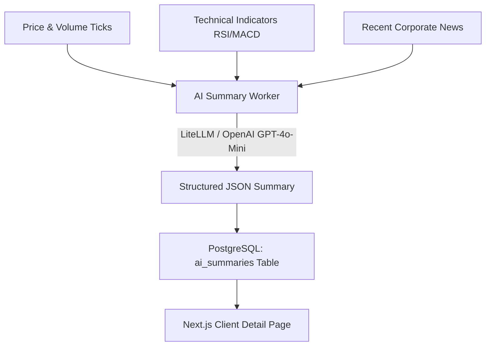

# Tài liệu Kiến trúc AI Service & Hướng dẫn Kích hoạt Hoạt động

Tài liệu này chi tiết hóa **Vai trò của AI**, luồng xử lý bất đồng bộ kết hợp hàng đợi **BullMQ + Redis**, các giải pháp tối ưu hóa Token (Token Shield) và hướng dẫn chi tiết cách kích hoạt, kiểm tra hoạt động của AI Service trong dự án **Stock Intelligence SaaS Platform**.

---

## 1. Vai trò của AI trong Hệ thống (Qualitative Intelligence Layer)

Trong một nền tảng phân tích tài chính thông thường, người dùng dễ bị ngợp bởi hàng tá biểu đồ nến, chỉ số kỹ thuật và hàng trăm tin tức rời rạc. Vai trò của **AI Service** (`apps/worker-ai`) là đóng vai trò làm **"Bộ não phân tích định tính" (Qualitative Intelligence Layer)** của hệ thống:

*   **Tổng hợp Đa chiều:** Gom dữ liệu kỹ thuật từ chỉ báo (RSI, MACD), biến động giá thời gian thực từ bảng `Quote` và 3 tin tức doanh nghiệp gần nhất (`NewsArticle`).
*   **Đưa ra Phán quyết Đầu tư (Decision Thesis):** Thay vì bắt nhà đầu tư tự đọc tin và xem chart, AI đưa ra một luận điểm phân tích ngắn gọn dưới 120 từ cực kỳ chuyên nghiệp và tập trung vào chất xúc tác (catalyst) và khối lượng giao dịch.
*   **Phân loại Rõ ràng:** Cung cấp định lượng về các nhân tố tích cực (**Catalysts**), rủi ro hệ thống (**Risk Factors**), xu hướng tâm lý (**Sentiment: BULLISH/NEUTRAL/BEARISH**) kèm độ tin cậy (**Confidence Score**).



---

## 2. Luồng Vận Hành Bất Đồng Bộ (BullMQ + Redis)

Để đảm bảo trang chi tiết cổ phiếu tải **tức thì (< 20ms)** và bảo vệ trải nghiệm người dùng khỏi thời gian gọi LLM chậm chạp (thường mất từ 3s - 8s), hệ thống sử dụng kiến trúc xử lý nền bất đồng bộ:

```text
User mở trang /instruments/HPG
  ↓
API Gateway trả ngay dữ liệu giá & signals hiện tại (< 20ms)
  ↓
API kiểm tra AI Summary:
  ├── Trường hợp 1: Đã có summary hoạt động & chưa quá 6 tiếng => Trả về UI ngay lập tức.
  └── Trường hợp 2: Chưa có hoặc đã hết hạn (> 6 tiếng)
        ↓
        Kích hoạt Reactive Queue: API tự động đẩy một Job 'generate-summary' vào Redis BullMQ
        ↓
        HTTP connection đóng ngay, không bắt user chờ
        ↓
        [worker-ai] nhận job từ Redis -> Gọi OpenAI API/Simulation -> Ghi kết quả vào PostgreSQL
        ↓
        User F5 hoặc nhận Update qua WebSockets -> AI Summary hiển thị hoàn chỉnh
```

---

## 3. Các Lớp Tối Ưu Hóa Chi Phí (Token Shield & Cache)

Gọi AI liên tục sẽ cực kỳ tốn chi phí và làm hệ thống dễ bị nghẽn (Rate Limit). Thiết kế chuẩn Senior 10 năm kinh nghiệm đã thiết lập **3 tầng bảo vệ Token (Token Shield)**:

1.  **Database Cache Shield (6-Hour TTL):** Hệ thống chỉ tạo summary mới khi bản ghi cũ đã quá 6 giờ. Mọi lượt truy cập của hàng nghìn user khác nhau trong khoảng thời gian này đều tái sử dụng cache, phí API bằng $0$.
2.  **Context Compression (Nén ngữ cảnh):** Thay vì gửi toàn bộ bài báo HTML hoặc lịch sử giá hàng chục ngày, hệ thống nén thành các mã chỉ báo ngắn gọn (ví dụ: `RSI_OVERSOLD (Strength: HIGH)`) và chỉ lấy tối đa 3 tiêu đề tin tức đã được cắt ngắn dưới 100 ký tự.
3.  **Native JSON Formatting:** Áp dụng chế độ `{ type: 'json_object' }` cùng model giá rẻ hiệu năng cao `gpt-4o-mini`, loại bỏ hoàn toàn các câu từ mở đầu dông dài của AI, tiết kiệm 30% lượng token đầu ra.

---

## 4. Tại Sao Chưa Thấy AI Hoạt Động? Hướng dẫn Kích hoạt Nhanh

Nếu bạn vừa cài đặt hoặc khởi động dự án mà chưa thấy AI hiển thị trên giao diện hoặc logs của `worker-ai` chưa nhảy, hãy thực hiện theo 4 bước kiểm tra và kích hoạt chuẩn dưới đây:

### Bước 1: Khởi động lại terminal phát triển (Rất Quan Trọng) ⚠️

Trong môi trường Monorepo chạy bằng **Turborepo** và **NestJS CLI**, khi chúng ta bổ sung các liên kết thư viện mới (như Runtime Database Enums từ `@stock-intel/db`), trình biên dịch đang chạy ngầm (`pnpm dev` đang hoạt động) sẽ **không tự nạp lại** các type liên kết này.
*   **Cách xử lý:** Mở terminal đang chạy `pnpm dev`, nhấn `Ctrl + C` để dừng hẳn.
*   Chạy lại lệnh để nạp toàn bộ container và các package mới liên kết:
    ```bash
    pnpm dev
    ```

### Bước 2: Đảm bảo Hạ tầng Docker & Redis đang chạy

BullMQ dùng Redis làm bộ nhớ hàng đợi trung chuyển. Nếu Redis chưa bật, backend sẽ không thể đẩy job vào hàng đợi.
*   Hãy chắc chắn rằng bạn đã khởi động hạ tầng bằng lệnh:
    ```bash
    pnpm infra:up
    ```
*   Bạn có thể truy cập **Redis Commander** tại `http://localhost:8081` để kiểm tra hàng đợi có tên `ai-summary` đang hoạt động.

### Bước 3: Cơ chế Reactive - Cần tải trang hoặc gọi API để kích hoạt

AI không được cào sẵn lúc Seed database để tránh lãng phí Token. Nó hoạt động theo cơ chế **Lazy-Loading (chỉ chạy khi có người xem)**.
*   **Cách kích hoạt:** Bạn hãy mở trình duyệt và truy cập vào chi tiết một cổ phiếu bất kỳ nằm trong danh mục VN30 hỗ trợ sẵn như:
    *   `http://localhost:3000/instruments/HPG` (Hoa Phat Group)
    *   `http://localhost:3000/instruments/FPT` (FPT Corporation)
    *   `http://localhost:3000/instruments/VND` (VNDirect)
    *   `http://localhost:3000/instruments/VNM` (Vinamilk)
    *   `http://localhost:3000/instruments/MSN` (Masan Group)
    *   `http://localhost:3000/instruments/MWG` (Thế Giới Di Động)
*   **Hiện tượng:** Ở lần đầu tiên bạn click vào xem, do AI Summary chưa có sẵn, hệ thống sẽ trả về giao diện mặc định chưa có phân tích và **lập tức bắn một job ngầm vào queue**.
*   **Kết quả:** Hãy nhìn vào cửa sổ terminal đang chạy `pnpm dev`. Bạn sẽ thấy logs của `worker-ai` sáng lên:
    ```text
    [AiSummaryProcessor] 🤖 Processing AI Summary request for HPG…
    [AiSummaryProcessor] ✅ Simulated fallback AI summary created for HPG. ID: cl...
    ```
*   Bây giờ, hãy **F5 (Refresh) lại trình duyệt**. AI Summary với đầy đủ luận điểm đầu tư chuyên sâu, các điểm xúc tác (Catalysts), rủi ro (Risks) và Sentiment sẽ hiển thị vô cùng rực rỡ và trực quan trên giao diện!

### Bước 4: Chế độ Giả lập Phân tích (Visual Simulation Fallback)

Để bảo vệ trải nghiệm của nhà phát triển và tránh yêu cầu cấu hình API key phức tạp ở local:
*   Nếu biến môi trường `OPENAI_API_KEY` trong file `.env` chưa được điền (hoặc đang để mặc định dạng `sk-...`), hệ thống sẽ **tự động kích hoạt bộ giả lập phân tích tài chính toán học nâng cao** cho 6 mã bluechip hàng đầu (HPG, FPT, VND, VNM, MSN, MWG).
*   Bộ giả lập này sinh ra dữ liệu có cấu trúc chuẩn chỉnh, nội dung phân tích tài chính bám sát thực tế thị trường của từng doanh nghiệp, giúp giao diện Frontend hiển thị đẹp mắt, đầy đủ tính năng và sẵn sàng cho việc kiểm thử UI/UX.

---

> [!TIP]
> **Mẹo phát triển:** Bạn có thể mở giao diện quản trị cơ sở dữ liệu Prisma Studio thông qua lệnh `pnpm db:studio` để xem trực tiếp các bản ghi phân tích vừa được AI sinh ra trong bảng `AiSummary`.
