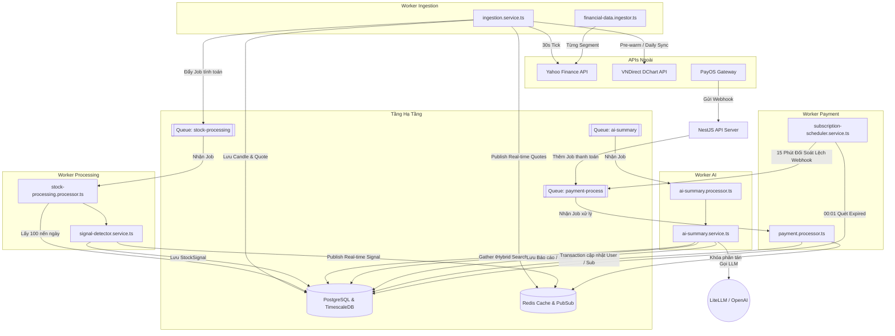

# TÀI LIỆU KIẾN TRÚC VÀ CHI TIẾT WORKERS SYSTEM
## DỰ ÁN: **STOCK INTELLIGENCE SAAS PLATFORM**

Tài liệu này cung cấp chi tiết kỹ thuật chuyên sâu về tầng xử lý nền bất đồng bộ (Background Workers) trong hệ thống Monorepo của dự án. Đây là các dịch vụ xử lý dữ liệu nặng, thực hiện thông qua mô hình Event-driven và hàng đợi (BullMQ/Redis), tách biệt hoàn toàn khỏi luồng HTTP API chính nhằm đảm bảo hiệu năng và tính ổn định tối đa.

---

## Sơ Đồ Tổng Quan Luồng Công Việc (Workers Workflow)

Các Worker tương tác chặt chẽ với nhau thông qua cơ sở dữ liệu chung (PostgreSQL) và hệ thống hàng đợi Redis (BullMQ):



---

## 1. Worker Ingestion (`apps/worker-ingestion`)

> [!IMPORTANT]
> **Vai trò hệ thống:** Đây là worker đầu vào (Ingress Engine). Nó chịu trách nhiệm giữ cho dữ liệu thị trường và thông tin cơ bản doanh nghiệp luôn mới nhất.
> - **Tầm quan trọng:** Tier 1 - Critical (Nếu chết, bảng điện tử và toàn bộ các phân tích kỹ thuật/AI sẽ bị ngưng đốn do thiếu dữ liệu thô).
> - **Độ phức tạp:** High (I/O-bound rất cao do tương tác mạng bên ngoài liên tục, xử lý ghi dữ liệu tần suất cao vào DB, tích hợp các cơ chế fallback nguồn và tự động điều tiết concurrency).

### a. Các Module & File Cốt Lõi
*   [ingestion.service.ts](file:///c:/Users/tuanl/Documents/Project%20Tuan/Stock-Intelligence-Saas/apps/worker-ingestion/src/ingestion.service.ts): Trọng tâm điều phối. Khởi chạy bootstrap danh sách cổ phiếu HOSE, đồng bộ nến lịch sử chạy nền, định kỳ chạy cron cào quote 30 giây một lần.
*   [financial-data.ingestor.ts](file:///c:/Users/tuanl/Documents/Project%20Tuan/Stock-Intelligence-Saas/apps/worker-ingestion/src/ingestor/financial-data.ingestor.ts): Tải thông tin tài chính phân mảnh (Profile, Shareholders, Dividends, Income Statement) từ Yahoo Finance API.
*   [market-data-batch.ingestor.ts](file:///c:/Users/tuanl/Documents/Project%20Tuan/Stock-Intelligence-Saas/apps/worker-ingestion/src/ingestor/market-data-batch.ingestor.ts): Xử lý gom nhóm ghi nhớ dữ liệu thị trường theo batch để tối ưu ghi DB.

### b. Cơ Chế Thiết Kế Hệ Thống Của Ingestion
1.  **Bootstrap tự động:** Khi ứng dụng khởi động, nếu cơ sở dữ liệu trống, service sẽ tự tạo sàn `HOSE` và cào thông tin cơ bản cho các mã chiến lược (VNM, VCB, FPT, MWG, HPG, VHM, VIC, MSN, TCB, MBB).
2.  **Cron cào giá 30s (`ingestMarketData`):** Sử dụng `@Cron('*/30 * * * * *')` để lấy giá thị trường thực. Để không gây quá tải và bị chặn IP, các request được xử lý theo lô (`CONCURRENCY = 5`) sử dụng `Promise.allSettled`.
3.  **Real-time Streaming & Caching:** Giá mới cào được lưu trữ ngay vào Redis Cache làm bản sao tạm thời tốc độ cao, đồng thời bắn tin nhắn lên Redis PubSub để luồng Socket gửi ngay tới khách hàng.
4.  **Đồng bộ biểu đồ lịch sử nền (Pre-warming):** Tự động fetch 3 năm nến ngày (`1D`) từ VNDirect DChart API lúc khởi chạy. Tác vụ chạy bất đồng bộ hoàn toàn để không chặn tiến trình khởi động của NestJS. Thêm trễ 1 giây (`setTimeout(resolve, 1000)`) giữa các mã để thân thiện với rate limit công cộng.

### c. Rủi Ro Hệ Thống & Chiến Lược Resilience
*   **Overlapping Cron Protection:** Sử dụng cờ lưu trong ram `isIngesting = true/false`. Nếu chu kỳ trước chưa chạy xong do nghẽn mạng, chu kỳ sau sẽ bị bỏ qua (`Skipping this tick`) thay vì chạy chồng lấn gây tràn ram và nghẽn DB.
*   **Idempotency (Độc lập tuyến tính):** Sử dụng `upsert` trên bảng `Candle` với chỉ mục `instrumentId_timeframe_timestamp` để đảm bảo dữ liệu ghi trùng chỉ bị cập nhật chứ không sinh ra lỗi khóa chính hoặc trùng dòng.

---

## 2. Worker Processing (`apps/worker-processing`)

> [!IMPORTANT]
> **Vai trò hệ thống:** Đây là bộ não phân tích kỹ thuật (Quant Analysis Engine) định lượng dữ liệu giá thô thành các chỉ báo tài chính trực quan.
> - **Tầm quan trọng:** Tier 2 - Important (Nếu ngưng hoạt động, hệ thống không cập nhật được RSI/MACD hay bắn tín hiệu mua bán, nhưng người dùng vẫn xem được giá trực tiếp).
> - **Độ phức tạp:** Medium (CPU-bound là chủ yếu do tính toán số học trên tập nến giá lịch sử, kết hợp ghi nhận tín hiệu).

### a. Các Module & File Cốt Lõi
*   [stock-processing.processor.ts](file:///c:/Users/tuanl/Documents/Project%20Tuan/Stock-Intelligence-Saas/apps/worker-processing/src/features/stock-processing.processor.ts): Consumer lắng nghe hàng đợi BullMQ `stock-processing`. Nhận tín hiệu cào xong từ Ingestion, tải 100 nến giá gần nhất để làm mẫu dữ liệu đầu vào.
*   [signal-detector.service.ts](file:///c:/Users/tuanl/Documents/Project%20Tuan/Stock-Intelligence-Saas/apps/worker-processing/src/features/signal-detector.service.ts): Trực tiếp triển khai các luật kiểm tra tín hiệu kỹ thuật (RSI, MACD, Volume Spike, Breakout/Breakdown) và sinh giải thích ngắn gọn bằng tiếng Việt.
*   [indicator-calculator.service.ts](file:///c:/Users/tuanl/Documents/Project%20Tuan/Stock-Intelligence-Saas/apps/worker-processing/src/features/indicator-calculator.service.ts): Chứa các hàm công thức toán học thuần túy để tính toán SMA, RSI, MACD.

### b. Các Tín Hiệu Hỗ Trợ Phân Tích
| Loại Chỉ Báo | Luật Kích Hoạt Tín Hiệu | Mức Độ | Ý Nghĩa Kỹ Thuật |
| :--- | :--- | :--- | :--- |
| **RSI Overbought** | RSI(14) > 70 | Medium / High (>80) | Cổ phiếu vào vùng quá mua sâu. |
| **RSI Oversold** | RSI(14) < 30 | Medium / High (<20) | Cổ phiếu rơi vào vùng quá bán sâu. |
| **MACD Golden Cross** | MACD cắt hướng lên trên đường Tín hiệu | Medium | Báo hiệu xu hướng tăng ngắn hạn. |
| **MACD Death Cross** | MACD cắt hướng xuống dưới đường Tín hiệu | Medium | Báo hiệu xu hướng giảm ngắn hạn. |
| **Volume Spike** | Khối lượng phiên hiện tại gấp > 2.5 lần trung bình 20 phiên | Medium / High (>4.0) | Dòng tiền lớn tham gia đột biến. |
| **Price Breakout** | Giá vượt đỉnh cao nhất của 20 phiên trước đó | High | Phá vỡ kháng cự đi lên. |
| **Price Breakdown** | Giá thủng đáy thấp nhất của 20 phiên trước đó | High | Thủng hỗ trợ rơi tự do. |

### c. Rủi Ro Hệ Thống & Chiến Lược Resilience
*   **Deduplication (Tránh lặp tín hiệu):** Trong ngày giao dịch, một mã chứng khoán có thể biến động liên tục kích hoạt việc cào dữ liệu nhiều lần. Để tránh việc bắn liên tiếp các thông báo trùng lặp trong cùng một ngày, `SignalDetectorService` thực hiện tìm kiếm bản ghi tín hiệu cùng loại đã được phát hiện từ mốc `00:00` của ngày hôm nay. Nếu đã tồn tại, nó sẽ chuyển sang chế độ cập nhật giá trị chỉ báo mới nhất (`update`) thay vì tạo mới (`create`).
*   **Redis PubSub Alerts:** Sau khi lưu vào DB thành công, tín hiệu lập tức được bắn lên kênh Redis PubSub giúp hệ thống API Gateway nhận biết và bắn thông báo đẩy (Live Notification) cho người dùng đăng ký gói VIP qua Socket.

---

## 3. Worker Payment (`apps/worker-payment`)

> [!IMPORTANT]
> **Vai trò hệ thống:** Xử lý và quản trị vòng đời tài chính SaaS tự động (Payment & Subscription Engine).
> - **Tầm quan trọng:** Tier 1 - Critical (Ảnh hưởng trực tiếp tới dòng tiền và doanh thu. Tuyệt đối không được xảy ra lỗi xử lý trùng lặp giao dịch nâng cấp tài khoản).
> - **Độ phức tạp:** High (Yêu cầu mức độ an toàn cao về mặt giao dịch cơ sở dữ liệu, quản trị khóa phân tán, và đối soát chênh lệch dữ liệu).

### a. Các Module & File Cốt Lõi
*   [payment.processor.ts](file:///c:/Users/tuanl/Documents/Project%20Tuan/Stock-Intelligence-Saas/apps/worker-payment/src/features/payment.processor.ts): Consumer lắng nghe hàng đợi BullMQ `payment-process` từ các webhook của PayOS hoặc SePay. Thực hiện nâng cấp gói và giải phóng cache của User.
*   [subscription-scheduler.service.ts](file:///c:/Users/tuanl/Documents/Project%20Tuan/Stock-Intelligence-Saas/apps/worker-payment/src/features/subscription-scheduler.service.ts): Chạy các tác vụ quét dọn tự động định kỳ bao gồm hạ cấp gói hết hạn lúc 00:01 và đối soát bù các giao dịch pending lệch webhook mỗi 15 phút.

### b. Giải Pháp Thiết Kế Bảo Mật 2 Lớp (Double-spending Prevention)
Để đảm bảo một hóa đơn thanh toán thành công chỉ nâng cấp tài khoản của người dùng đúng một lần duy nhất, tránh lỗi Double-spending do các webhook ngân hàng gửi trùng hoặc click nhầm của nhân viên đối soát, worker áp dụng thiết kế bảo vệ 2 lớp:

1.  **Lớp 1: Khóa phân tán (Distributed Lock) trên Redis:**
    *   Trước khi xử lý job, worker cố gắng ghi vào Redis khóa `lock:payment:process:${referenceCode}` với thời gian hết hạn 10 giây thông qua câu lệnh không ghi đè `NX`.
    *   Nếu không lấy được khóa (do một tiến trình khác đang xử lý hóa đơn này song song), job sẽ lập tức dừng lại (`Skip job`) nhằm triệt tiêu các luồng xử lý đồng thời.
2.  **Lớp 2: Transaction Cô Lập & Kiểm tra trạng thái Database:**
    *   Toàn bộ mã xử lý logic nghiệp vụ được bọc trong một Database Transaction cô lập `prisma.$transaction`.
    *   Bên trong transaction, hệ thống truy vấn thông tin hóa đơn và áp dụng kiểm tra:
        ```typescript
        if (dbTx.status === 'SUCCESS') {
            return { status: 'ALREADY_SUCCESS' }; // Dừng xử lý
        }
        ```
    *   Nếu hợp lệ, trạng thái hóa đơn mới được cập nhật lên `SUCCESS`, gia hạn gói Subscription thêm 30 ngày, ghi lại lịch sử `userActivity`, và giải phóng bộ nhớ đệm cache của User trên Redis để quyền lợi VIP có hiệu lực lập tức.

### c. Quy Trình Đối Soát Tự Động (Self-Healing Bank Reconciliation)
*   **Vấn đề:** Webhook của PayOS/SePay có thể bị thất lạc do mạng chập chờn, dẫn đến việc người dùng đã chuyển khoản thành công nhưng tài khoản chưa được nâng cấp.
*   **Giải pháp:** Cron job `@Cron('0 */15 * * * *')` chạy mỗi 15 phút quét các đơn hàng ở trạng thái `PENDING` được tạo trong 2 giờ qua. Nó thực hiện gọi trực tiếp API đối soát cổng thanh toán. Nếu phát hiện đơn hàng đã thực sự thanh toán thành công phía ngân hàng, hệ thống tự sinh và đẩy bù một Job xử lý thanh toán vào BullMQ để phục hồi quyền lợi tự động cho khách hàng.

---

## 4. Worker AI (`apps/worker-ai`)

> [!IMPORTANT]
> **Vai trò hệ thống:** Lõi xử lý phân tích và tổng hợp thông tin nâng cao bằng trí tuệ nhân tạo (AI RAG Engine).
> - **Tầm quan trọng:** Tier 2 - Important (Cung cấp báo cáo giá trị gia tăng cao cho gói Premium. Nếu dừng hoạt động, người dùng không tải được báo cáo phân tích mới).
> - **Độ phức tạp:** High (Kết hợp tính toán Vector Embeddings, Hybrid Search với hệ số giảm thời gian theo ngày, tích hợp mô hình ngôn ngữ lớn qua LiteLLM, và cơ chế giả lập dữ liệu dự phòng).

### a. Các Module & File Cốt Lõi
*   [ai-summary.processor.ts](file:///c:/Users/tuanl/Documents/Project%20Tuan/Stock-Intelligence-Saas/apps/worker-ai/src/features/ai-summary/ai-summary.processor.ts): Consumer lắng nghe hàng đợi BullMQ `ai-summary`.
*   [ai-summary.service.ts](file:///c:/Users/tuanl/Documents/Project%20Tuan/Stock-Intelligence-Saas/apps/worker-ai/src/features/ai-summary/ai-summary.service.ts): Trọng tâm xử lý luồng Hybrid RAG, gọi LLM, xử lý cache và kích hoạt cơ chế fallback.
*   [embedding-ingester.service.ts](file:///c:/Users/tuanl/Documents/Project%20Tuan/Stock-Intelligence-Saas/apps/worker-ai/src/features/ai-summary/helper/embedding-ingester.service.ts): Tự động hóa việc chunking và nhét vector hóa mô tả doanh nghiệp cùng các bài báo chí mới nhất vào Vector DB (Qdrant/Milvus).
*   [hybrid-retriever.service.ts](file:///c:/Users/tuanl/Documents/Project%20Tuan/Stock-Intelligence-Saas/apps/worker-ai/src/features/ai-summary/helper/hybrid-retriever.service.ts): Thực hiện truy xuất dữ liệu định tính sử dụng thuật toán kết hợp Vector Search và Text Search kèm hệ số suy giảm giá trị theo thời gian của bài viết (Recency Decay).

### b. Luồng Hybrid RAG Phân Tích Cổ Phiếu
Để giải quyết triệt để lỗi "ảo tưởng" (hallucination) của LLM về mặt số liệu tài chính nhạy cảm, Worker AI áp dụng kiến trúc Hybrid RAG kết hợp cứng & mềm:

1.  **Dữ liệu định lượng cứng (Quantitative Data):**
    *   Hệ thống dùng `MarkdownGeneratorService` truy vấn dữ liệu báo cáo tài chính, chỉ số EPS, P/E, P/B thật trong PostgreSQL và chuyển đổi thành một bảng biểu cấu trúc Markdown chuẩn xác 100%.
2.  **Dữ liệu định tính mềm (Qualitative Data):**
    *   Sử dụng Hybrid Retriever tìm kiếm các đoạn tin tức hoạt động và sự kiện liên quan thông qua Vector DB.
    *   Các bài tin tức cũ sẽ bị nhân thêm hệ số suy giảm thời gian $\lambda = 0.05$ để ưu tiên tin nóng trong tuần qua.
3.  **LLM Generation:** Biên soạn 2 nguồn dữ liệu này vào prompt mẫu tối ưu bằng tiếng Việt và gửi đến mô hình GPT-4o-mini qua API LiteLLM.

### c. Các Thiết Kế Tự Phục Hồi & Fallback
*   **Self-Healing Embeddings:** Trước khi phân tích, worker luôn thực hiện kiểm tra chéo xem dữ liệu tin tức và hồ sơ doanh nghiệp đã được đánh index lên Vector DB chưa. Nếu phát hiện thiếu, nó tự động trích xuất và nạp bổ sung embeddings ngay trong tiến trình xử lý (Self-Healing).
*   **Simulation Fallback (Giữ trải nghiệm người dùng):** Cuộc gọi LLM ra bên ngoài có thể gặp lỗi (hết credit tài khoản OpenAI, API timeout). Để người dùng VIP không nhận về một trang báo cáo trống hoặc lỗi quay vòng vô tận, Worker AI tích hợp `FallbackProvider`. Nếu cuộc gọi LLM thất bại, hệ thống tự sinh một báo cáo tài chính mô phỏng chất lượng cao, định dạng chuyên nghiệp hoàn toàn bằng tiếng Việt và lưu vào DB với nhãn model là `system-simulation-fallback-v1`.
*   **Thời hạn Cache:** Các báo cáo được đánh dấu thời hạn hợp lệ trong vòng 6 giờ (`CACHE_HOURS = 6`). Trong khoảng thời gian này, các request tạo báo cáo cho cùng một mã cổ phiếu sẽ nhận kết quả cache hit tức thì từ database, tiết kiệm tài nguyên hệ thống và chi phí API LLM.

---

## Tóm tắt Tương tác Giữa Các Workers

| Tên Worker | Nguồn kích hoạt | Điểm nhận tiếp theo | Lưu trữ đích | Tài nguyên sử dụng |
| :--- | :--- | :--- | :--- | :--- |
| **worker-ingestion** | Cron định kỳ 30s / Bootstrap | Queue: `stock-processing`, Redis PubSub | PostgreSQL, Redis Cache | Yahoo Finance API, VNDirect API |
| **worker-processing** | Job trong queue `stock-processing` | Redis PubSub (Tín hiệu) | PostgreSQL | PostgreSQL, Redis PubSub |
| **worker-payment** | Queue: `payment-process` / Cron 15m & 00:01 | Redis Cache Invalidation | PostgreSQL, Redis Lock | PayOS/SePay APIs, PostgreSQL |
| **worker-ai** | Queue: `ai-summary` / Web Request | Kết quả trả về API | PostgreSQL, Vector DB | LiteLLM (OpenAI), Vector Database |
