# TÀI LIỆU CHI TIẾT CÁC ỨNG DỤNG VÀ WORKERS SYSTEM

## DỰ ÁN: **STOCK INTELLIGENCE SAAS PLATFORM**

Tài liệu này cung cấp chi tiết kỹ thuật chuyên sâu về toàn bộ các ứng dụng (Apps) và hệ thống xử lý nền bất đồng bộ (Background Workers) trong Monorepo của dự án Stock Intelligence. Đây là cẩm nang kiến trúc giúp lập trình viên hiểu rõ vai trò, cơ chế bảo mật, tương tác dữ liệu và cách vận hành các thành phần trong thư mục `apps/`.

---

## Sơ Đồ Kiến Trúc Luồng Dữ Liệu Toàn Hệ Thống

Dưới đây là sơ đồ chi tiết về sự tương tác giữa Web Frontend, API Server, hệ thống hàng đợi Redis (BullMQ), cơ sở dữ liệu PostgreSQL và các dịch vụ nền:

```mermaid
flowchart TD
    subgraph Client_Layer [Tầng Client]
        Web[apps/web: Next.js Frontend]
    end

    subgraph API_Layer [Tầng API Server]
        API[apps/api: NestJS API Server]
    end

    subgraph External_Systems [Hệ Thống Ngoài]
        YF[Yahoo Finance API]
        VND[VNDirect DChart API]
        PayOS[PayOS Gateway]
    end

    subgraph Storage_Layer [Tầng Lưu Trữ & Hàng Đợi]
        Postgres[(PostgreSQL & TimescaleDB)]
        RedisCache[(Redis Cache & PubSub)]
        Q_Proc[[Queue: stock-processing]]
        Q_Pay[[Queue: payment-process]]
        Q_AI[[Queue: ai-summary]]
    end

    subgraph Workers_Layer [Tầng Xử Lý Nền - Workers]
        WI[worker-ingestion: Cào dữ liệu]
        WP[worker-processing: Tính chỉ báo]
        WPay[worker-payment: Xử lý thanh toán]
        WA[worker-ai: Phân tích RAG & LLM]
    end

    %% Client & API Interaction
    Web -- 1. Gửi HTTPS Request (Đính kèm HMAC x-signature & Token) --> API
    API -- 2. Trả về Response mã hóa AES-256-GCM --> Web
    Web -- 3. Đăng nhập / Xoay vòng Token (NextAuth) --> API

    %% API to DB & Cache
    API -- 4. Đọc/Ghi dữ liệu kinh doanh --> Postgres
    API -- 5. Lưu/Truy xuất cache & Đăng ký Live Socket --> RedisCache

    %% Ingestion Flow
    WI -- 6. Cron 30s cào giá --> YF
    WI -- 7. Đồng bộ nến lịch sử --> VND
    WI -- 8. Lưu Candle & Quote --> Postgres
    WI -- 9. Stream Live Quotes --> RedisCache
    WI -- 10. Đẩy job tính chỉ số --> Q_Proc

    %% Processing Flow
    Q_Proc -- 11. Nhận Job --> WP
    WP -- 12. Lấy 100 nến & tính chỉ báo --> Postgres
    WP -- 13. Lưu StockSignal --> Postgres
    WP -- 14. Publish Live Signal --> RedisCache
    RedisCache -- 15. Push Live Alert qua WebSocket --> Web

    %% Payment Flow
    PayOS -- 16. Webhook thanh toán --> API
    API -- 17. Đẩy Job hóa đơn --> Q_Pay
    Q_Pay -- 18. Nhận Job & Khóa phân tán --> WPay
    WPay -- 19. Nâng cấp Subscription --> Postgres
    WPay -- 20. Invalidate User Cache --> RedisCache

    %% AI Flow
    Web -- 21. Yêu cầu phân tích mã --> API
    API -- 22. Đẩy Job AI Summary --> Q_AI
    Q_AI -- 23. Nhận Job & Chạy RAG --> WA
    WA -- 24. Embedding Self-Healing --> Postgres
    WA -- 25. Gọi LLM --> OpenAI((LiteLLM / OpenAI))
    WA -- 26. Lưu báo cáo & PDF --> Postgres
```

---

## 1. Ứng Dụng Web Frontend Client (`apps/web`)

> [!IMPORTANT]
> **Vai trò hệ thống:** Ứng dụng Next.js chịu trách nhiệm hiển thị giao diện người dùng, cung cấp biểu đồ tài chính tương tác, bảng điện tử thời gian thực và khu vực quản lý cá nhân hóa cho nhà đầu tư.
>
> - **Tầm quan trọng:** Tier 1 - Critical (Là điểm chạm trực tiếp của khách hàng. Mọi lỗi ở đây đều ảnh hưởng tức thì đến trải nghiệm sử dụng dịch vụ).
> - **Độ phức tạp:** High (Kết hợp Server-Side Rendering (SSR), quản lý trạng thái NextAuth, và bảo mật mã hóa HTTP Client-Side).

### a. Các Module & File Cốt Lõi

- [api-client.ts](file:///c:/Users/tuanl/Documents/Project%20Tuan/Stock-Intelligence-Saas/apps/web/src/lib/api/api-client.ts): Cấu hình HttpClient tập trung bằng Axios, chứa toàn bộ cơ chế bảo mật (HMAC Signature, AES-256-GCM Decryption) và cơ chế Token Rotation.
- `src/app`: Cấu trúc thư mục Next.js App Router (Dashboard, Watchlist, Market, Settings).
- `src/components`: Các UI Component tái sử dụng (Bảng giá, biểu đồ tài chính, cổng thanh toán).

### b. Cơ Chế Bảo Mật & HTTP Client-Side

Để bảo vệ tài nguyên dữ liệu và ngăn chặn các hành vi thu thập dữ liệu tự động (scrapers), `api-client.ts` thực hiện các cơ chế bảo mật đặc biệt sau:

1.  **Request Signature (HMAC SHA-256):**
    - Mỗi request gửi từ trình duyệt được đính kèm 3 headers: `x-signature` (chữ ký số), `x-timestamp` (mốc thời gian), và `x-nonce` (chuỗi ngẫu nhiên tránh Replay Attack).
    - Chữ ký được sinh tự động thông qua hàm `generateSignature` bằng cách băm chuỗi định dạng `${Method}:${Path}:${Timestamp}:${Nonce}:${Body}` bằng Web Crypto API của trình duyệt với Secret Key chia sẻ.
2.  **Mã Hóa Dữ Liệu Trả Về (AES-256-GCM Decryption):**
    - Khi API trả về dữ liệu dạng mã hóa (đánh dấu qua header `x-encrypted: true`), Axios Response Interceptor tự động bắt và thực hiện giải mã trực tiếp trong bộ nhớ (In-memory Decryption) thông qua hàm `decryptPayload` trước khi trả dữ liệu về component. Điều này giúp ngăn chặn việc lộ lọt dữ liệu thô trên mạng.
3.  **Xoay Vòng Token Tự Động (Silent Token Rotation):**
    - Access Token hết hạn sau 15 phút. Khi API trả về lỗi `401 Unauthorized`, Axios Interceptor sẽ chặn lại:
      1. Gửi ngầm request lên `/auth/refresh` kèm `refreshToken` để lấy cặp Token mới.
      2. Cập nhật NextAuth Session Client bằng cách gửi POST yêu cầu lên `/api/auth/session` với trigger `update`.
      3. Gửi lại request ban đầu bị lỗi với Access Token mới giúp người dùng không cảm nhận thấy sự gián đoạn.

---

## 2. Ứng Dụng API Gateway & Backend (`apps/api`)

> [!IMPORTANT]
> **Vai trò hệ thống:** Máy chủ NestJS REST API và WebSockets đóng vai trò là API Gateway bảo mật, cổng định tuyến, xử lý nghiệp vụ kinh doanh chính, quản lý phân quyền và kiểm soát luồng giao tiếp.
>
> - **Tầm quan trọng:** Tier 1 - Critical (Lõi logic trung tâm. Nếu sập, toàn bộ hệ thống sẽ mất khả năng hoạt động).
> - **Độ phức tạp:** High (Xử lý xác thực phức tạp, phân quyền chặt chẽ, mã hóa và ký số dữ liệu HTTP, kết nối cơ sở dữ liệu và điều phối các hàng đợi BullMQ).

### a. Các Module & File Cốt Lõi

- [main.ts](file:///c:/Users/tuanl/Documents/Project%20Tuan/Stock-Intelligence-Saas/apps/api/src/main.ts): Cấu hình ứng dụng NestJS, thiết lập bảo mật cơ bản (Helmet, CORS Whitelist, Cookie Parser), gán bộ lọc lỗi `HttpExceptionFilter` và bộ ghi nhật ký `LoggingInterceptor`.
- `src/auth`: Module quản lý phân quyền, xử lý đăng nhập, cấp phát JWT, xác thực ID Token từ Google OAuth.
- `src/subscription`: Module xử lý các giao dịch nâng cấp tài khoản, tích hợp webhook từ PayOS/SePay và quản lý hạn ngạch API.

### b. Cơ Chế Bảo Mật & API Gateway

NestJS API được bảo vệ nghiêm ngặt qua 3 lớp phòng thủ tại cổng HTTP:

1.  **Lớp 1: Chống Spam & DDoS (Throttler Rate Limiter):** Giới hạn số lượng request trên mỗi địa chỉ IP của Client.
2.  **Lớp 2: Kiểm Tra Chữ Ký (HMAC Verification Guard):**
    - Đọc các header `x-signature`, `x-timestamp`, và `x-nonce`.
    - Tính toán lại chữ ký băm từ thông tin request hiện tại. Nếu chữ ký không trùng khớp hoặc mốc thời gian lệch quá 5 phút so với giờ máy chủ, request bị từ chối ngay lập tức (`403 Forbidden`).
3.  **Lớp 3: Mã Hóa Dữ Liệu Nhạy Cảm (AES-256-GCM Interceptor):**
    - Các dữ liệu nhạy cảm liên quan đến chỉ báo độc quyền, thông tin thanh toán hoặc phân tích AI trước khi gửi đi sẽ được mã hóa bằng khóa bảo mật AES-32bytes.
    - Response trả về có dạng JSON chứa: `{ iv, content, tag }` và đính kèm header `x-encrypted: true`.

---

## 3. Worker Ingestion (`apps/worker-ingestion`)

> [!IMPORTANT]
> **Vai trò hệ thống:** Worker đầu vào thu thập dữ liệu thô (Ingress Engine).
>
> - **Tầm quan trọng:** Tier 1 - Critical.
> - **Độ phức tạp:** High (I/O-bound rất cao do tương tác mạng bên ngoài liên tục, xử lý ghi dữ liệu tần suất cao vào DB).

### a. Các Module & File Cốt Lõi

- [ingestion.service.ts](file:///c:/Users/tuanl/Documents/Project%20Tuan/Stock-Intelligence-Saas/apps/worker-ingestion/src/ingestion.service.ts): Trọng tâm điều phối. Khởi chạy bootstrap danh sách cổ phiếu HOSE, đồng bộ nến lịch sử chạy nền, định kỳ chạy cron cào quote 30 giây một lần.
- [financial-data.ingestor.ts](file:///c:/Users/tuanl/Documents/Project%20Tuan/Stock-Intelligence-Saas/apps/worker-ingestion/src/ingestor/financial-data.ingestor.ts): Tải thông tin tài chính phân mảnh (Profile, Shareholders, Dividends, Income Statement) từ Yahoo Finance API.
- [market-data-batch.ingestor.ts](file:///c:/Users/tuanl/Documents/Project%20Tuan/Stock-Intelligence-Saas/apps/worker-ingestion/src/ingestor/market-data-batch.ingestor.ts): Xử lý gom nhóm ghi nhớ dữ liệu thị trường theo batch để tối ưu ghi DB.

### b. Cơ Chế Thiết Kế Hệ Thống Của Ingestion

1.  **Cron cào giá 30s:** Sử dụng `@Cron('*/30 * * * * *')` để lấy giá thị trường thực. Các request được xử lý theo lô (`CONCURRENCY = 5`) sử dụng `Promise.allSettled`.
2.  **Đồng bộ biểu đồ lịch sử nền (Pre-warming):** Tự động fetch 3 năm nến ngày (`1D`) từ VNDirect DChart API lúc khởi chạy. Tác vụ chạy bất đồng bộ hoàn toàn để không chặn tiến trình khởi động của NestJS. Thêm trễ 1 giây (`setTimeout(resolve, 1000)`) giữa các mã để thân thiện với rate limit công cộng.

### c. Rủi Ro Hệ Thống & Chiến Lược Resilience

- **Overlapping Cron Protection:** Sử dụng cờ lưu trong ram `isIngesting = true/false`. Nếu chu kỳ trước chưa chạy xong do nghẽn mạng, chu kỳ sau sẽ bị bỏ qua (`Skipping this tick`) để tránh nghẽn DB.
- **Idempotency:** Sử dụng `upsert` trên bảng `Candle` với chỉ mục `instrumentId_timeframe_timestamp` để đảm bảo dữ liệu ghi trùng chỉ bị cập nhật chứ không sinh ra lỗi khóa chính.

---

## 4. Worker Processing (`apps/worker-processing`)

> [!IMPORTANT]
> **Vai trò hệ thống:** Phân tích kỹ thuật định lượng dữ liệu giá thô thành các chỉ báo tài chính trực quan.
>
> - **Tầm quan trọng:** Tier 2 - Important (Không làm gián đoạn luồng giá nhưng ảnh hưởng đến tín hiệu kỹ thuật).
> - **Độ phức tạp:** Medium (CPU-bound chủ yếu do tính toán số học SMA, RSI, MACD).

### a. Các Module & File Cốt Lõi

- [stock-processing.processor.ts](file:///c:/Users/tuanl/Documents/Project%20Tuan/Stock-Intelligence-Saas/apps/worker-processing/src/features/stock-processing.processor.ts): Consumer lắng nghe hàng đợi BullMQ `stock-processing`. Nhận tín hiệu cào xong từ Ingestion, tải 100 nến giá gần nhất để làm mẫu dữ liệu đầu vào.
- [signal-detector.service.ts](file:///c:/Users/tuanl/Documents/Project%20Tuan/Stock-Intelligence-Saas/apps/worker-processing/src/features/signal-detector.service.ts): Trực tiếp triển khai các luật kiểm tra tín hiệu kỹ thuật (RSI, MACD, Volume Spike, Breakout/Breakdown) và sinh giải thích ngắn gọn bằng tiếng Việt.
- [indicator-calculator.service.ts](file:///c:/Users/tuanl/Documents/Project%20Tuan/Stock-Intelligence-Saas/apps/worker-processing/src/features/indicator-calculator.service.ts): Chứa các hàm công thức toán học thuần túy để tính toán SMA, RSI, MACD.

### b. Rủi Ro Hệ Thống & Chiến Lược Resilience

- **Deduplication:** Hạn chế bắn lặp tín hiệu trong cùng một ngày giao dịch bằng cách tìm kiếm bản ghi tín hiệu cùng loại đã được phát hiện từ mốc `00:00` của ngày hôm nay. Nếu đã tồn tại, nó chuyển sang chế độ cập nhật (`update`) thay vì tạo mới (`create`).
- **Redis PubSub Alerts:** Sau khi lưu vào DB thành công, tín hiệu lập tức được bắn lên kênh Redis PubSub giúp hệ thống API Gateway nhận biết và bắn thông báo đẩy (Live Notification) cho người dùng đăng ký gói VIP qua Socket.

---

## 5. Worker Payment (`apps/worker-payment`)

> [!IMPORTANT]
> **Vai trò hệ thống:** Xử lý và quản trị vòng đời tài chính SaaS tự động (Payment & Subscription Engine).
>
> - **Tầm quan trọng:** Tier 1 - Critical (Tuyệt đối không được xảy ra lỗi xử lý trùng lặp giao dịch nâng cấp tài khoản).
> - **Độ phức tạp:** High (Yêu cầu mức độ an toàn cao về mặt giao dịch cơ sở dữ liệu, quản trị khóa phân tán, và đối soát chênh lệch dữ liệu).

### a. Các Module & File Cốt Lõi

- [payment.processor.ts](file:///c:/Users/tuanl/Documents/Project%20Tuan/Stock-Intelligence-Saas/apps/worker-payment/src/features/payment.processor.ts): Consumer lắng nghe hàng đợi BullMQ `payment-process` từ các webhook của PayOS hoặc SePay. Thực hiện nâng cấp gói và giải phóng cache của User.
- [subscription-scheduler.service.ts](file:///c:/Users/tuanl/Documents/Project%20Tuan/Stock-Intelligence-Saas/apps/worker-payment/src/features/subscription-scheduler.service.ts): Chạy các tác vụ quét dọn tự động định kỳ bao gồm hạ cấp gói hết hạn lúc 00:01 và đối soát bù các giao dịch pending lệch webhook mỗi 15 phút.

### b. Giải Pháp Thiết Kế Bảo Mật 2 Lớp (Double-spending Prevention)

1.  **Lớp 1: Khóa phân tán (Distributed Lock) trên Redis:** Worker ghi vào Redis khóa `lock:payment:process:${referenceCode}` với thời gian hết hạn 10 giây thông qua câu lệnh không ghi đè `NX`. Nếu không lấy được khóa, job dừng lại lập tức.
2.  **Lớp 2: Transaction Cô Lập & Kiểm tra trạng thái:** Toàn bộ mã xử lý logic nghiệp vụ được bọc trong một Database Transaction cô lập `prisma.$transaction`. Hệ thống kiểm tra xem trạng thái đơn hàng đã là `SUCCESS` trước đó chưa, nếu rồi thì dừng lại, nếu chưa thì tiến hành nâng cấp gói và cập nhật trạng thái đơn hàng.

### c. Quy Trình Đối Soát Tự Động (Self-Healing Bank Reconciliation)

- Cron job `@Cron('0 */15 * * * *')` chạy mỗi 15 phút quét các đơn hàng ở trạng thái `PENDING` được tạo trong 2 giờ qua. Nó thực hiện gọi trực tiếp API đối soát cổng thanh toán. Nếu phát hiện đơn hàng đã thực sự thanh toán thành công phía ngân hàng, hệ thống tự sinh và đẩy bù một Job xử lý thanh toán vào BullMQ để phục hồi quyền lợi tự động cho khách hàng.

---

## 6. Worker AI (`apps/worker-ai`)

> [!IMPORTANT]
> **Vai trò hệ thống:** Lõi xử lý phân tích và tổng hợp thông tin nâng cao bằng trí tuệ nhân tạo (AI RAG Engine).
>
> - **Tầm quan trọng:** Tier 2 - Important (Cung cấp báo cáo giá trị gia tăng cao cho gói Premium).
> - **Độ phức tạp:** High (Kết hợp tính toán Vector Embeddings, Hybrid Search với hệ số giảm thời gian theo ngày, tích hợp mô hình ngôn ngữ lớn qua LiteLLM, và cơ chế giả lập dữ liệu dự phòng).

### a. Các Module & File Cốt Lõi

- [ai-summary.processor.ts](file:///c:/Users/tuanl/Documents/Project%20Tuan/Stock-Intelligence-Saas/apps/worker-ai/src/features/ai-summary/ai-summary.processor.ts): Consumer lắng nghe hàng đợi BullMQ `ai-summary`.
- [ai-summary.service.ts](file:///c:/Users/tuanl/Documents/Project%20Tuan/Stock-Intelligence-Saas/apps/worker-ai/src/features/ai-summary/ai-summary.service.ts): Trọng tâm xử lý luồng Hybrid RAG, gọi LLM, xử lý cache và kích hoạt cơ chế fallback.
- [embedding-ingester.service.ts](file:///c:/Users/tuanl/Documents/Project%20Tuan/Stock-Intelligence-Saas/apps/worker-ai/src/features/ai-summary/helper/embedding-ingester.service.ts): Tự động hóa việc chunking và nhét vector hóa mô tả doanh nghiệp cùng các bài báo chí mới nhất vào Vector DB (Qdrant/Milvus).
- [hybrid-retriever.service.ts](file:///c:/Users/tuanl/Documents/Project%20Tuan/Stock-Intelligence-Saas/apps/worker-ai/src/features/ai-summary/helper/hybrid-retriever.service.ts): Thực hiện truy xuất dữ liệu định tính sử dụng thuật toán kết hợp Vector Search và Text Search kèm hệ số suy giảm giá trị theo thời gian của bài viết (Recency Decay).

### b. Luồng Hybrid RAG Phân Tích Cổ Phiếu

1.  **Dữ liệu định lượng cứng:** `MarkdownGeneratorService` truy vấn dữ liệu báo cáo tài chính thật trong PostgreSQL và chuyển đổi thành bảng biểu cấu trúc Markdown chuẩn xác 100% nhằm triệt tiêu lỗi ảo tưởng (hallucination).
2.  **Dữ liệu định tính mềm:** Sử dụng Hybrid Retriever tìm kiếm các đoạn tin tức hoạt động thông qua Vector DB. Các bài viết cũ sẽ bị nhân thêm hệ số suy giảm thời gian $\lambda = 0.05$ để ưu tiên tin nóng.
3.  **LLM Generation:** Biên soạn 2 nguồn dữ liệu này vào prompt mẫu và gửi đến mô hình GPT-4o-mini qua API LiteLLM.

### c. Các Thiết Kế Tự Phục Hồi & Fallback

- **Self-Healing Embeddings:** Trước khi phân tích, worker luôn thực hiện kiểm tra chéo xem dữ liệu tin tức và hồ sơ doanh nghiệp đã được đánh index lên Vector DB chưa. Nếu phát hiện thiếu, nó tự động trích xuất và nạp bổ sung embeddings ngay trong tiến trình xử lý.
- **Simulation Fallback (Giữ trải nghiệm người dùng):** Nếu cuộc gọi LLM thất bại, `FallbackProvider` tự sinh một báo cáo tài chính mô phỏng chất lượng cao, định dạng chuyên nghiệp hoàn toàn bằng tiếng Việt và lưu vào DB với nhãn model là `system-simulation-fallback-v1` để giao diện người dùng không bị lỗi.

---

## Tóm tắt Tương tác Giữa Các Ứng Dụng & Workers

| Tên Service/App       | Vai trò         | Trigger chính                            | Tương tác chính                            | Storage / Queue liên quan                          |
| :-------------------- | :-------------- | :--------------------------------------- | :----------------------------------------- | :------------------------------------------------- |
| **apps/web**          | Frontend Client | User Interaction                         | Gọi HTTPS REST API, Lắng nghe Websocket    | Trình duyệt Local Storage / Cookies                |
| **apps/api**          | API Gateway     | Client Request / Webhooks                | Routing, Check Auth/Signature, Đẩy Queue   | PostgreSQL, Redis Cache, BullMQ Queues             |
| **worker-ingestion**  | Data Ingestor   | Cron định kỳ 30s / Boot                  | Cào API ngoài (Yahoo Finance/VNDirect)     | PostgreSQL, Redis Cache, Queue: `stock-processing` |
| **worker-processing** | Quant Processor | Job trong queue `stock-processing`       | Tính SMA, RSI, MACD. Phát tín hiệu mua/bán | PostgreSQL, Redis PubSub                           |
| **worker-payment**    | Billing Engine  | Job trong queue `payment-process` / Cron | Đối soát, nâng cấp/hạ cấp gói subscription | PostgreSQL, Redis Lock                             |
| **worker-ai**         | AI RAG Engine   | Job trong queue `ai-summary`             | Gọi LiteLLM API, Hybrid Retrieve Vector DB | PostgreSQL, Vector Database (Qdrant)               |
