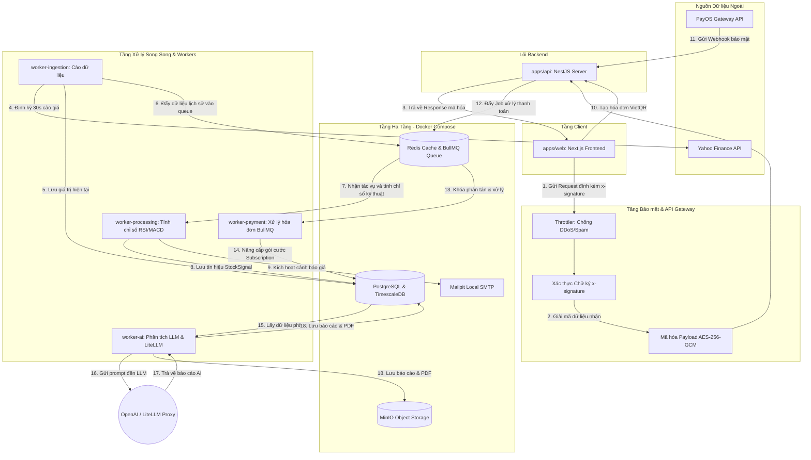

# TÀI LIỆU TOÀN CẢNH KIẾN TRÚC HỆ THỐNG
## DỰ ÁN: **STOCK INTELLIGENCE SAAS PLATFORM** (Dành cho Thành viên mới)

Chào mừng bạn gia nhập đội ngũ phát triển **Stock Intelligence**! Tài liệu này cung cấp cái nhìn toàn cảnh, chi tiết và thực tế nhất về kiến trúc hệ thống hiện tại. Hãy đọc kỹ tài liệu này để hiểu cách các mảnh ghép (Backend, Frontend, Workers, Security, Payment, AI) hoạt động cùng nhau, giúp bạn bắt nhịp dự án nhanh nhất và tránh bị stuck (nghẽn) ở bất kỳ bước nào.

---

## 1. Sơ đồ Luồng Dữ liệu Toàn hệ thống (System Data Pipeline)

Dưới đây là sơ đồ kiến trúc dòng chảy dữ liệu bao gồm cả luồng cào thông tin chứng khoán, bảo mật API, cổng thanh toán tự động, và lõi AI:



---

## 2. Kiến trúc Monorepo & Quản lý Phụ thuộc (`pnpm workspaces`)

Dự án được quản lý dưới dạng **Monorepo** bằng **Turborepo** và **pnpm**. Điều này cho phép chia sẻ mã nguồn dùng chung cực kỳ dễ dàng qua thư mục `packages/`:

### a. Phân bổ các Package dùng chung (`packages/`)
*   **`packages/db`**: Đóng gói **Prisma ORM** và cấu hình schema. Mọi thao tác kết nối DB của các service con đều thông qua thư viện nội bộ `@stock-intel/db`. Điều này đảm bảo tính nhất quán (Single Source of Truth).
*   **`packages/contracts`**: Chứa toàn bộ **TypeScript Types, Interfaces, DTOs (Data Transfer Objects)** và schemas xác thực Zod. Cả Frontend (`apps/web`) và Backend (`apps/api`) đều dùng chung package này để đồng bộ hóa cấu trúc dữ liệu truyền nhận.
*   **`packages/utils`**: Chứa các hàm helper dùng chung như định dạng tiền tệ, xử lý ngày tháng, thuật toán tài chính.
*   **`packages/config`**: Chứa cấu hình chia sẻ cho ESLint, TypeScript (`tsconfig.json`), Prettier nhằm đồng bộ coding style toàn dự án.

> [!IMPORTANT]
> **Quy định pnpm v11 (Allow Builds):**
> Kể từ phiên bản **pnpm v11**, thuộc tính `onlyBuiltDependencies` trong `package.json` đã bị loại bỏ. Tất cả các quyền thực thi build scripts của bên thứ ba (như `bcrypt`, `prisma`, `sharp`...) phải được khai báo rõ ràng trong thuộc tính `allowBuilds` tại tệp tin [`pnpm-workspace.yaml`](file:///c:/Users/tuanl/Documents/Project%20Tuan/Stock-Intelligence-Saas/pnpm-workspace.yaml). Nếu cài thư viện mới báo lỗi build, hãy bổ sung tên thư viện vào danh sách whitelist này.

---

## 3. Hệ thống Bảo mật API Gateway (API Security Layers)

Để bảo vệ tài nguyên dữ liệu thị trường và ngăn chặn các hành vi thu thập dữ liệu trái phép (crawlers), spam hoặc tấn công DDoS, cổng giao tiếp REST API được bảo mật qua 3 lớp:

1.  **Rate Limiting (Throttler):** Giới hạn tần suất gọi API của mỗi IP nhằm ngăn chặn tấn công DDoS.
2.  **HMAC Request Signature Verification:** 
    *   Mỗi request từ client gửi đi đều được đính kèm 3 headers: `x-signature` (chữ ký băm HMAC-SHA256), `x-timestamp` (thời gian gửi), và `x-nonce` (chuỗi ngẫu nhiên chống tấn công phát lại - Replay Attack).
    *   Backend tự tính toán lại chữ ký dựa trên Payload và Secret Key. Nếu không trùng khớp, request sẽ bị từ chối ngay lập tức.
3.  **AES-256-GCM Payload Encryption:** 
    *   Các dữ liệu nhạy cảm hoặc dữ liệu thị trường trả về từ Backend đều được mã hóa bằng thuật toán đối xứng AES-256-GCM ở lớp HTTP.
    *   Client nhận về payload dạng chuỗi hex kèm mã xác thực tag và IV, giải mã trực tiếp ở client-side trong bộ lọc interceptor.

---

## 4. Quy trình Đăng nhập, Google OAuth & Xoay vòng Token

Hệ thống tích hợp cả đăng nhập bằng Email/Password truyền thống và **Google OAuth2** thông qua thư viện **NextAuth** phía Client và bộ kiểm tra ID Token trên Backend:

```
[Google Sign-In] ──> Lấy Google ID Token ──> Gửi lên API Backend ──> Xác thực Google Client ID
                                                                           │
                                                                           ▼
[Cập nhật NextAuth] <── Trả về cặp Token mới <── Sinh Access Token + Refresh Token (Database)
```

### Cơ chế tự động xoay vòng Token (Silent Token Rotation)
*   **Access Token** có thời hạn ngắn (15 phút) để bảo mật. **Refresh Token** lưu ở Database có thời hạn dài (7 ngày).
*   Khi Access Token hết hạn, Axios Interceptor trong [`api-client.ts`](file:///c:/Users/tuanl/Documents/Project%20Tuan/Stock-Intelligence-Saas/apps/web/src/lib/api/api-client.ts) sẽ tự động phát hiện mã lỗi `401` và thực hiện:
    1.  Gửi ngầm request lên `/auth/refresh` kèm `refreshToken` để lấy cặp Token mới từ Backend.
    2.  Gửi yêu cầu cập nhật lại Session NextAuth thông qua `POST /api/auth/session` với cấu trúc lồng chuẩn:
        ```json
        {
          "trigger": "update",
          "session": {
            "accessToken": "new_access_token",
            "refreshToken": "new_refresh_token"
          }
        }
        ```
    3.  Tự động gửi lại (retry) request ban đầu bị lỗi bằng Token mới mà người dùng không hề hay biết.

---

## 5. Hệ thống Thanh toán SaaS (PayOS / SePay Integration)

Hệ thống hỗ trợ cả hai cổng thanh toán tự động phổ biến nhất tại Việt Nam là **PayOS** (cổng thanh toán VietQR chuyên nghiệp) và **SePay** (chuyển khoản ngân hàng trực tiếp).

### a. Kiến trúc Xử lý Hóa đơn Bất đồng bộ (Asynchronous Payment Processing)
Khi người dùng thực hiện thanh toán:
1.  **Tạo giao dịch PENDING:** Hệ thống sinh mã hóa đơn duy nhất (`referenceCode` dạng `SIXXXXXXXX`) và lưu trạng thái `PENDING` vào bảng `BillingTransaction`.
2.  **Quét VietQR động:** Hệ thống tự động tạo mã QR VietQR chuẩn NAPAS chứa thông tin Tài khoản thụ hưởng, Số tiền và chính xác Nội dung chuyển khoản là `referenceCode`.
3.  **Nhận Webhook từ Cổng thanh toán:** 
    *   Khi tiền vào tài khoản, PayOS hoặc SePay sẽ gửi một HTTP POST (Webhook) chứa thông tin giao dịch về API Backend (`/subscription/webhook/payos` hoặc `/subscription/webhook/sepay`).
    *   Backend xác thực chữ ký số băm bảo mật (HMAC-SHA256) của webhook để chống giả mạo gói tin.
4.  **Hàng đợi BullMQ (worker-payment):** 
    *   Sau khi xác thực webhook hợp lệ, Backend đẩy một Job thanh toán vào hàng đợi Redis BullMQ có tên `payment-process`.
    *   Dịch vụ [`apps/worker-payment`](file:///c:/Users/tuanl/Documents/Project%20Tuan/Stock-Intelligence-Saas/apps/worker-payment) sẽ xử lý Job bất đồng bộ này. Nó áp dụng cơ chế **Khóa phân tán (Distributed Lock)** bằng Redis trên `referenceCode` nhằm loại bỏ hoàn toàn rủi ro xử lý trùng lặp giao dịch (Double-spending/Concurrency issues).
    *   Tiến hành cập nhật trạng thái hóa đơn thành `SUCCESS`, nâng cấp gói dịch vụ (`Subscription` thành `PRO` hoặc `API`) và giải phóng cache của user.

### b. Cơ chế Bypass thông minh trong môi trường Development (Sandbox Mode)
Để hỗ trợ việc kiểm thử (Testing/Manual Approval) nhanh chóng mà không cần phải chuyển tiền thật hay cấu hình webhook phức tạp:
*   **Nút "Tôi Đã Chuyển Khoản":** Khi người dùng nhấn nút này:
    *   **Trên Production (`NODE_ENV=production`):** Hệ thống sẽ chỉ kiểm tra trạng thái thực trong Database. Nếu ngân hàng chưa báo tiền về, nó sẽ trả về thông báo từ chối. API nâng cấp trực tiếp thủ công bị **khóa chặn hoàn toàn** (`403 Forbidden`).
    *   **Trên Development (`NODE_ENV=development`):** Hệ thống sẽ cho phép bypass và gọi API `POST /subscription/direct-upgrade` để nâng cấp trực tiếp tài khoản vào database PostgreSQL ngay lập tức, phục vụ test local nhanh gọn.

---

## 6. Hướng dẫn Khởi chạy Nhanh & Cách Tránh Bị Stuck

Để thiết lập môi trường phát triển local hoạt động hoàn hảo trong lần đầu tiên, hãy thực hiện đúng theo các bước sau:

### Bước 1: Khởi động tầng Hạ tầng (Docker Compose)
Chạy lệnh sau tại thư mục gốc dự án để khởi chạy Postgres, Redis, MinIO và Mailpit:
```bash
pnpm infra:up
```
> [!TIP]
> *   Để kiểm tra email giả lập gửi đi: Truy cập giao diện **Mailpit** tại `http://localhost:8025`.
> *   Để xem dữ liệu cache và queue: Truy cập **Redis Commander** tại `http://localhost:8081`.
> *   Để xem file lưu trữ: Truy cập **MinIO Console** tại `http://localhost:9001` (User/Password: `minioadmin` / `minioadmin`).

### Bước 2: Thiết lập Cơ sở dữ liệu (Prisma & Seed)
Di chuyển vào thư mục package DB, chạy di trú database và nạp dữ liệu mẫu (Seed):
```bash
# Đồng bộ DB schema
pnpm --filter @stock-intel/db prisma db push

# Nạp dữ liệu thị trường và tài khoản mẫu ban đầu
pnpm --filter @stock-intel/db prisma db seed
```
> [!NOTE]
> Tài khoản mẫu mặc định sau khi seed:
> *   Email: `admin@stockintel.com`
> *   Mật khẩu: `Admin123!`

### Bước 3: Đồng bộ hóa file cấu hình môi trường (.env)
Next.js chạy độc lập và yêu cầu file `.env` cục bộ. Hãy đảm bảo bạn đã copy file cấu hình môi trường từ thư mục gốc vào thư mục Frontend:
```bash
copy .env apps/web/.env
```

### Bước 4: Khởi chạy toàn bộ hệ thống
Khởi chạy tất cả các dịch vụ (API Backend, Web Frontend, Ingestion/Processing/Payment Workers) đồng thời bằng lệnh:
```bash
pnpm dev
```
> [!WARNING]
> Nếu bạn thay đổi bất kỳ giá trị cấu hình nào trong file [`.env`](file:///c:/Users/tuanl/Documents/Project%20Tuan/Stock-Intelligence-Saas/.env) (Ví dụ: Thay đổi tài khoản ngân hàng thụ hưởng nhận tiền thực), **bạn bắt buộc phải khởi động lại (Restart) Dev Server** để Node.js nạp lại các biến môi trường mới.

---

## 7. Các lỗi thường gặp (Troubleshooting)

| Triệu chứng | Nguyên nhân phổ biến | Cách khắc phục |
| :--- | :--- | :--- |
| **Lỗi `[ERR_PNPM_IGNORED_BUILDS]` khi cài thư viện** | Chưa cấp quyền build script cho thư viện đó trong pnpm v11 | Mở file `pnpm-workspace.yaml` bổ sung tên thư viện vào danh sách `allowBuilds` rồi chạy lại `pnpm install`. |
| **Lỗi CORS Preflight Blocked** | Client gửi custom header bảo mật (`x-signature`, `x-nonce`) nhưng Backend chưa whitelist | Đảm bảo file `apps/api/src/main.ts` đã khai báo whitelist các header này trong cấu hình CORS `allowedHeaders`. |
| **Không đăng nhập được bằng Google** | Thiếu file `.env` ở thư mục `apps/web` hoặc cấu hình Google OAuth sai | Chạy lệnh `copy .env apps/web/.env` và kiểm tra xem `GOOGLE_CLIENT_ID` trong console Google đã khớp với `.env` chưa. |
| **Mã QR VietQR báo "Ngân hàng thụ hưởng không hợp lệ" khi quét** | Đang dùng thông tin ngân hàng giả lập mặc định | Thay đổi các cấu hình `PAYMENT_BANK_ID`, `PAYMENT_BANK_ACCOUNT`, `PAYMENT_BANK_NAME` trong `.env` thành thông tin thẻ ngân hàng thật của bạn rồi restart server backend. |
