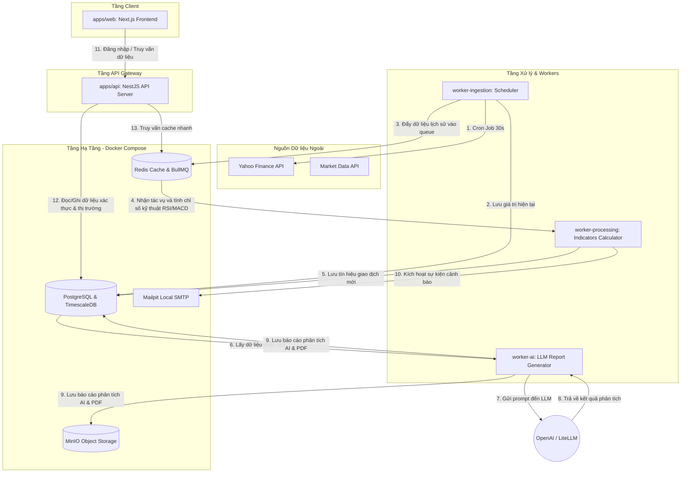

# BÁO CÁO PHÂN TÍCH KIẾN TRÚC HỆ THỐNG
## DỰ ÁN: **STOCK INTELLIGENCE SAAS PLATFORM**

Hệ thống được thiết kế theo kiến trúc **Monorepo (Multi-service/Microservices-like)** sử dụng **Turborepo** và **pnpm workspaces**. Đây là kiến trúc tiêu chuẩn công nghiệp giúp chia sẻ mã nguồn (models, types, utils) giữa Backend, Frontend và các Workers chạy nền một cách dễ dàng, đồng thời cho phép mở rộng (scale) độc lập từng thành phần khi tải trọng tăng cao.

---

## 1. Sơ đồ Luồng Dữ liệu Hệ thống (Data Pipeline Flow)

Dưới đây là sơ đồ cách dữ liệu chứng khoán được cào về, xử lý, lưu trữ và cung cấp tới người dùng cuối:

---

## 2. Chi tiết Kiến trúc Monorepo & Quản lý Phụ thuộc

Dự án sử dụng cơ chế **pnpm workspaces** định nghĩa tại file `pnpm-workspace.yaml` để liên kết các dự án con. Quá trình chia sẻ mã nguồn diễn ra tại thư mục `packages/`:

1.  **`packages/db`:** 
    *   Đóng gói **Prisma ORM** và cấu hình schema.
    *   Tất cả các Service như `apps/api`, `apps/worker-processing` muốn kết nối Database đều không tự viết schema riêng mà sẽ import trực tiếp thư viện nội bộ `@stock-intel/db`. Điều này đảm bảo tính nhất quán (Single Source of Truth).
2.  **`packages/contracts`:**
    *   Chứa các **TypeScript Types, Interfaces, DTOs (Data Transfer Objects)** và schemas xác thực (như Zod/Class-validator).
    *   Giúp cả Frontend (`apps/web`) và Backend (`apps/api`) luôn đồng bộ về kiểu dữ liệu khi truyền nhận qua HTTP API.
3.  **`packages/utils`:**
    *   Chứa các hàm helper dùng chung như định dạng tiền tệ, xử lý ngày tháng, thuật toán tài chính cơ bản.
4.  **`packages/config`:**
    *   Chứa cấu hình chia sẻ cho ESLint, TypeScript (`tsconfig.json`), Prettier nhằm đồng bộ coding convention toàn dự án.

**Turborepo (`turbo.json`)** đóng vai trò là "bộ não" quản lý build pipeline. Nó giúp tối ưu hóa việc chạy lệnh (như `build`, `lint`, `test`) bằng cách sử dụng cơ chế **Caching** (nếu code của service đó không đổi, lệnh build sẽ lấy từ cache lập tức thay vì build lại từ đầu).

---

## 3. Phân tích Chi tiết Cơ sở Dữ liệu (Prisma Schema Deep Dive)

Schema cơ sở dữ liệu (`schema.prisma`) được thiết kế để giải quyết các nghiệp vụ tài chính phức tạp:

### a. Phân quyền và Gói dịch vụ (SaaS Monitization)
*   **`User`**: Quản lý thông tin đăng nhập, trạng thái tài khoản (`UserStatus`: `ACTIVE`, `SUSPENDED`, `DELETED`).
*   **`Subscription`**: Quản lý gói cước của người dùng (`SubscriptionTier`: `FREE`, `PRO`, `API`) cùng thời hạn gia hạn (`renewalAt`).
*   **`ApiKey`**: Dành cho người dùng mua gói `API` để tự động tích hợp dữ liệu của hệ thống vào bot giao dịch của họ.

### b. Quản lý Dữ liệu Thị trường (Time-series & Relational Data)
*   **`Exchange` & `Sector` & `Instrument`**: Quản lý thông tin mã chứng khoán (ví dụ: Symbol: `AAPL`, Tên: `Apple Inc`, sàn `US Equities`, nhóm ngành công nghệ).
*   **`Quote`**: Lưu trữ dữ liệu giá khớp lệnh liên tục (Giá mở cửa, cao nhất, thấp nhất, khối lượng giao dịch).
*   **`Candle`**: Lưu trữ dữ liệu nến lịch sử cho các khung thời gian (`timeframe` như `1m`, `5m`, `1h`, `1d`). 
    > **Thiết kế tối ưu:** Database sử dụng **TimescaleDB** (một extension của PostgreSQL chuyên cho dữ liệu chuỗi thời gian). TimescaleDB tự động phân vùng (partitioning) bảng `Quote` và `Candle` theo thời gian giúp các câu lệnh truy vấn hàng tỷ dòng dữ liệu nến chỉ mất vài mili-giây.

### c. Nghiệp vụ Người dùng (Watchlists & Portfolios)
*   **`Watchlist` & `WatchlistItem`**: Danh sách cổ phiếu người dùng đang quan tâm theo dõi.
*   **`Portfolio`**: Danh mục tài sản thực tế của người dùng.
*   **`PortfolioTransaction`**: Lưu lịch sử mua/bán (`BUY`/`SELL`), số lượng, mức giá và phí giao dịch (`fee`).
*   **`PortfolioPosition`**: Tổng hợp số dư hiện tại của từng mã cổ phiếu, tự động tính toán **Giá vốn trung bình (Average Cost)** mỗi khi có giao dịch mua/bán mới.

### d. Trí tuệ Nhân tạo & Tín hiệu Giao dịch (Intelligence Layers)
*   **`StockSignal`**: Các tín hiệu kỹ thuật được tạo tự động (`RSI_OVERBOUGHT`, `MACD_BULLISH`, v.v.) đi kèm độ mạnh yếu (`strength`) và giải thích lý do bằng chữ (`explanation`).
*   **`StockScore`**: Điểm số chấm điểm cổ phiếu từ 0 - 100 và xếp hạng (`STRONG_BUY`, `BUY`, `HOLD`, `SELL`) dựa trên 5 khía cạnh: kỹ thuật, cơ bản (fundamentals), đà tăng trưởng (momentum), định giá (valuation) và tâm lý đám đông (sentiment).
*   **`AiSummary`**: Lưu phân tích từ mô hình AI bao gồm các yếu tố thúc đẩy (`drivers`), rủi ro (`risks`), xu hướng tâm lý (`sentiment`) và độ tin cậy (`confidence`).

---

## 4. Cách Hoạt động của Từng Service (`apps/`)

### 1. `apps/api` (NestJS REST API Server)
*   Đóng vai trò là **Gateway** tương tác trực tiếp với người dùng cuối.
*   Xử lý việc đăng ký, đăng nhập (sử dụng JWT lưu trong Cookie để bảo mật tránh lỗi XSS), quản lý hồ sơ người dùng.
*   Cung cấp các API truy vấn giá cổ phiếu, dữ liệu nến cho biểu đồ, danh mục đầu tư, cấu hình cảnh báo.
*   Khi có các truy vấn nặng về dữ liệu tĩnh hoặc dữ liệu ít thay đổi, nó sẽ truy cập **Redis** để lấy dữ liệu cache thay vì truy cập PostgreSQL.

### 2. `apps/worker-ingestion` (Dịch vụ Thu thập Dữ liệu)
*   Sử dụng `@nestjs/schedule` để chạy các tác vụ nền định kỳ (Cron jobs).
*   Mỗi 30 giây (trong môi trường phát triển local), nó tự động lấy danh sách cổ phiếu cần theo dõi (`WATCH_SYMBOLS`), gọi API bên ngoài để cập nhật giá mới nhất (`yahoo-finance2`), lưu trữ dữ liệu vào bảng `Quote`.
*   Nó chịu trách nhiệm kích hoạt luồng tính toán kỹ thuật bằng cách nạp dữ liệu lịch sử và đẩy các task vào hàng đợi **Redis BullMQ**.

### 3. `apps/worker-processing` (Dịch vụ Tính toán Kỹ thuật)
*   Lắng nghe hàng đợi từ Redis. Khi nhận được task tính toán chỉ số, nó sử dụng thư viện toán học tài chính (`technicalindicators`) để tính toán RSI, MACD, Bollinger Bands...
*   Nếu phát hiện chỉ số chạm ngưỡng bất thường (ví dụ: RSI dưới 30 - quá bán), nó sẽ ghi nhận một tín hiệu (`StockSignal`) mới vào Database và đẩy một sự kiện cảnh báo (Alert) vào queue.

### 4. `apps/worker-ai` (Dịch vụ AI Phân tích)
*   Được kích hoạt định kỳ hoặc khi có tin tức mới (`NewsArticle`) quan trọng được đưa vào hệ thống.
*   Nó sẽ gom dữ liệu về giá, tin tức gần đây của mã cổ phiếu, sau đó gửi yêu cầu tới OpenAI API hoặc qua **LiteLLM** (một proxy giúp phân phối tải và dự phòng lỗi giữa nhiều mô hình như GPT-4, Claude, Llama).
*   Nó tổng hợp các phản hồi JSON cấu trúc, lưu trữ vào bảng `AiSummary` phục vụ cho Frontend hiển thị biểu đồ phân tích thông minh.

### 5. `apps/web` (Next.js Frontend)
*   Được xây dựng bằng React & Next.js App Router để tối ưu hóa SEO cho trang landing page và tốc độ tải trang dashboard.
*   Sử dụng các thư viện biểu đồ chuyên nghiệp (như Lightweight Charts của TradingView hoặc Recharts) để hiển thị nến kỹ thuật, các đường chỉ báo và lịch sử giao dịch trực quan.

---

## 5. Các Công cụ Hạ tầng Bổ trợ (Tầng Infrastructure)

Khi bạn khởi chạy dự án thông qua Docker Compose (`pnpm infra:up`), các container được cấu hình nhằm hỗ trợ phát triển local một cách tối đa:
*   **Mailpit (Port 8025):** Là một SMTP server giả lập. Khi code backend gửi email cảnh báo giá hoặc mã kích hoạt tài khoản cho user, email đó sẽ không gửi đi thật mà rơi vào Mailpit. Bạn truy cập giao diện web của Mailpit để kiểm tra định dạng email trực quan.
*   **Redis Commander (Port 8081):** Giao diện quản trị Redis giúp bạn kiểm tra xem cache đang lưu những gì, trạng thái các queue BullMQ đang chạy/lỗi ra sao.
*   **MinIO Console (Port 9001):** S3-compatible Object Storage giúp giả lập Amazon S3 ở local để lưu trữ các file báo cáo PDF chứng khoán, ảnh đại diện người dùng.

---

## 6. Luồng Vận Hành Điển Hình (Ví dụ Thực tế)

Hãy tưởng tượng một kịch bản hệ thống vận hành thực tế:
1.  **Cào dữ liệu:** `worker-ingestion` chạy cron job cào được giá cổ phiếu `TSLA` giảm mạnh từ $200 về $170.
2.  **Lưu trữ & Kích hoạt tính toán:** Dữ liệu giá được lưu vào bảng `quotes`. Một task xử lý được gửi vào Redis BullMQ.
3.  **Phát hiện tín hiệu:** `worker-processing` nhận task, tính toán thấy RSI của `TSLA` rơi xuống mức `22` (cực kỳ quá bán). Worker này tạo một bản ghi `StockSignal` (loại `RSI_OVERSOLD`, độ mạnh `HIGH`).
4.  **Kích hoạt cảnh báo:**
    *   Hệ thống quét bảng `AlertRule` thấy User Stark có đặt luật: *"Gửi email cho tôi nếu TSLA có tín hiệu quá bán"*
    *   Hệ thống đẩy job gửi email vào queue.
    *   Worker gửi email gửi qua Mailpit, User nhận được thông báo.
5.  **AI Phân tích sâu:** 
    *   `worker-ai` tự động gom thông tin: Giá giảm + RSI quá bán + tin tức xấu về chuỗi cung ứng của Tesla vừa cào được.
    *   Nó gửi dữ liệu này cho OpenAI. OpenAI trả về phân tích: *Tâm lý Bearish ngắn hạn, nhưng RSI quá bán mạnh mở ra cơ hội bắt đáy dài hạn. Động lực tăng trưởng (driver): nhu cầu xe điện ở Trung Quốc vẫn duy trì tốt. Rủi ro (risk): thiếu hụt linh kiện.*
    *   Báo cáo AI được cập nhật lên Dashboard. Stark mở `apps/web` ra xem và đưa ra quyết định giao dịch chính xác.
