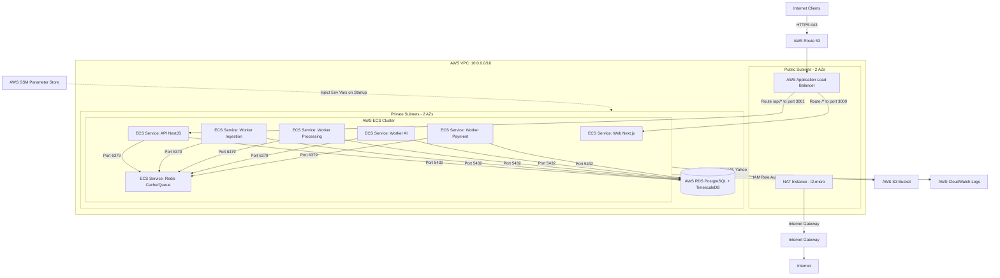

# Thiết kế & Kế hoạch Triển khai Hệ thống Cloud-Native 3-Tier trên AWS

Tài liệu này trình bày thiết kế kiến trúc hạ tầng **Cloud-Native** chuyên nghiệp cho dự án **Stock Intelligence SaaS Platform**, sử dụng các dịch vụ dịch vụ quản lý (Managed Services) của AWS. Thiết kế này giúp bạn tiếp cận thực tế với kiến trúc hệ thống hiện đại trên Cloud nhưng vẫn tối ưu hóa để chạy trong **AWS Free Tier**.

---

## 🏗️ Kiến trúc Cloud-Native Tổng quan (Architecture Diagram)

Thay vì chạy Docker Compose thủ công trên một máy ảo EC2 độc lập, hệ thống được cấu trúc lại hoàn toàn dựa trên các dịch vụ Cloud-Native của AWS:



---

## ☁️ Các Dịch vụ AWS Được Sử Dụng & Giải pháp Free-Tier

| Dịch vụ AWS | Vai trò trong hệ thống | Giải pháp tối ưu Free-Tier |
| :--- | :--- | :--- |
| **AWS ECS (EC2 Launch Type)** | Quản lý vòng đời container (Orchestration). Tự động restart, quản lý log và tài nguyên của Next.js, API, và các Workers. | Sử dụng **EC2 Launch Type** (ECS Agent chạy trên EC2 `t3.micro` Free-Tier). Không dùng **Fargate** vì Fargate tính phí theo giây sử dụng thực tế (không có Free Tier vĩnh viễn). |
| **AWS RDS (PostgreSQL)** | Lưu trữ dữ liệu hệ thống và dữ liệu chuỗi thời gian (Quotes/Candles). | Sử dụng `db.t3.micro` hoặc `db.t4g.micro` Single-AZ với 20GB Storage GP3. Cài extension `timescaledb` trực tiếp trên RDS thông qua Custom DB Parameter Group. |
| **AWS S3** | Lưu trữ báo cáo phân tích AI dạng PDF/JSON và ảnh đại diện. | Thay thế hoàn toàn MinIO bằng S3 Bucket chính chủ (Free Tier hỗ trợ 5GB và 20,000 Get Requests). |
| **AWS ALB** | Nhận và phân phối traffic HTTPS từ khách hàng. Định tuyến `/api/*` về Container NestJS API và `/*` về Container Next.js Frontend. | Được miễn phí 750 giờ/tháng ALB và 15 LCU cho 12 tháng đầu tiên của tài khoản Free Tier. |
| **AWS SSM Parameter Store** | Quản lý an toàn các tham số cấu hình hệ thống và Secrets (`DATABASE_URL`, `OPENAI_API_KEY`, `JWT_SECRET`). | Dịch vụ này hoàn toàn **miễn phí** cho các parameter dạng Standard (lên đến 10,000 keys), thay thế việc tạo file `.env` thủ công. |
| **AWS CloudWatch** | Thu thập, lưu trữ log từ các Task của ECS. Giúp debug tập trung các lỗi của API và Workers. | Sử dụng CloudWatch Logs Agent tích hợp sẵn trong ECS (`awslogs` driver). Free Tier hỗ trợ 5GB Log dữ liệu/tháng. |
| **NAT Instance** | Định tuyến outbound internet cho máy chủ trong Private Subnet (gọi các external API như OpenAI, Yahoo Finance). | Chạy một EC2 `t2.micro` hoặc `t3.micro` cấu hình iptables NAT ở Public Subnet. Tiết kiệm **$32/tháng** so với NAT Gateway. |

---

## 📂 Cấu trúc Thư mục Terraform (`infra/terraform`)

Mã nguồn Terraform được tổ chức thành các Module chuyên nghiệp như một dự án thực tế tại doanh nghiệp:

```struct
infra/terraform/
├── provider.tf             # Cấu hình AWS provider & khóa phiên bản
├── main.tf                 # File điều phối chính (gọi các module)
├── variables.tf            # Các biến cấu hình chung (Region, CIDR...)
├── outputs.tf              # Đầu ra thông tin hạ tầng
├── terraform.tfvars.example # File mẫu giá trị các biến
└── modules/
    ├── vpc/                # Thiết lập mạng (VPC, Subnets, IGW, NAT Instance, Route Tables)
    │   ├── main.tf
    │   ├── variables.tf
    │   └── outputs.tf
    ├── security_groups/    # Quản lý Security Group cho ALB, ECS Host, và RDS
    │   ├── main.tf
    │   ├── variables.tf
    │   └── outputs.tf
    ├── iam/                # IAM Roles cho ECS Task Execution (cho phép pull ECR, ghi CloudWatch) và ECS Task Role (cho phép đọc S3, SSM)
    │   ├── main.tf
    │   ├── variables.tf
    │   └── outputs.tf
    ├── s3/                 # AWS S3 Bucket
    │   ├── main.tf
    │   ├── variables.tf
    │   └── outputs.tf
    ├── ssm/                # Khởi tạo các parameter rỗng trên SSM để điền sau
    │   ├── main.tf
    │   ├── variables.tf
    │   └── outputs.tf
    ├── rds/                # RDS PostgreSQL với Custom Parameter Group cho TimescaleDB
    │   ├── main.tf
    │   ├── variables.tf
    │   └── outputs.tf
    └── ecs/                # ECS Cluster, Task Definitions, và ECS Services cho các app
        ├── main.tf
        ├── variables.tf
        └── outputs.tf
```

---

## ⚙️ Thiết kế Kỹ thuật Chi tiết (Technical Details)

### 1. Phân chia Tài nguyên Memory trên EC2 (ECS Container Host)
Vì EC2 `t3.micro` chỉ có **1GB RAM**, chúng ta cần đặt giới hạn RAM cứng (Hard Memory Limit) cho các ECS Tasks trong Task Definition:
* **Redis Container:** 128 MB (Chỉ làm hàng đợi BullMQ & Cache nhỏ).
* **Next.js Web:** 200 MB.
* **NestJS API:** 200 MB.
* **Workers (5 workers):** 80 MB mỗi worker (Tổng 400 MB).
* **ECS Agent + OS:** ~150 MB.
* *Tổng cộng:* ~1078 MB. Để tránh hiện tượng container bị kill do thiếu bộ nhớ (OOMKilled), chúng ta kích hoạt **4GB Swap Space** trên EC2 Instance Host.

### 2. Quản lý Config & Secret qua SSM Parameter Store
Chúng ta sẽ khai báo các tham số cấu hình trên AWS SSM:
* `/stock-intel/prod/database-url`
* `/stock-intel/prod/jwt-secret`
* `/stock-intel/prod/openai-api-key`
* `/stock-intel/prod/redis-host` (trỏ đến service discovery hoặc IP của Redis container)

Khi ECS khởi động các Task, AWS ECS sẽ tự động lấy các giá trị này từ SSM và tiêm (inject) vào container dưới dạng các biến môi trường thông qua khai báo `secrets` trong Task Definition.

### 3. Tích hợp CloudWatch Logs
Mỗi Task Definition sẽ cấu hình log driver:
```hcl
logConfiguration = {
  logDriver = "awslogs"
  options = {
    "awslogs-group"         = "/ecs/stock-intel-prod"
    "awslogs-region"        = "ap-southeast-1"
    "awslogs-stream-prefix" = "api" # hoặc web, worker-ai...
  }
}
```

---

## 🛠️ Quy trình CI/CD với GitHub Actions

Chúng ta sẽ chỉnh sửa file `.github/workflows/deploy-production.yml` thành quy trình deployment chuẩn Cloud:
1. **Build & Push:** Build các Docker image cho từng service (`api`, `web`, `workers`) và push lên **AWS ECR (Elastic Container Registry)** hoặc Docker Hub.
2. **Register Task Definition:** GitHub Actions tạo ra phiên bản mới của ECS Task Definition bằng cách cập nhật tag image mới nhất.
3. **Deploy ECS Service:** Gọi AWS CLI để update ECS Service. AWS ECS sẽ tự động thực hiện chiến lược **Rolling Update** (Khởi động container mới, kiểm tra Health Check qua ALB, nếu Healthy thì tắt container cũ) giúp hệ thống hoạt động liên tục không bị downtime (Zero-Downtime Deployment).

---

## 📌 Kế hoạch Kiểm thử & Xác minh (Verification Plan)

### Kiểm thử Tự động
- `terraform validate` để kiểm tra cấu trúc mã Terraform.
- `terraform plan` để kiểm chứng các tài nguyên AWS sẽ được tạo.

### Xác minh Thủ công trên AWS Console
1. **ECS Cluster Status:** Kiểm tra các service `web`, `api`, `workers` có trạng thái `ACTIVE` và các Task có trạng thái `RUNNING`.
2. **CloudWatch Logs:** Truy cập CloudWatch Logs Group `/ecs/stock-intel-prod` để kiểm tra log hoạt động từ các ứng dụng.
3. **RDS Database Extension:** Dùng DB client kết nối vào RDS (thông qua bastion/EC2) kiểm tra extension `timescaledb` đã được load thành công.
4. **S3 Bucket Access:** Upload avatar hoặc báo cáo, kiểm tra xem file có được lưu vào S3 Bucket và có thể đọc được qua IAM Role (không bị public).
